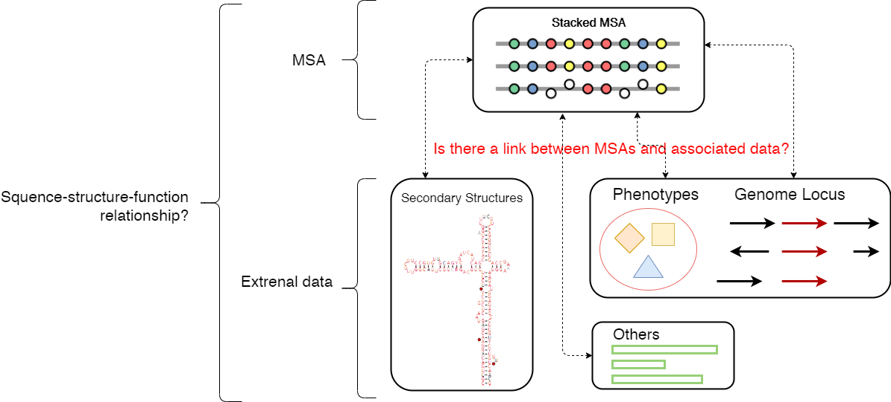
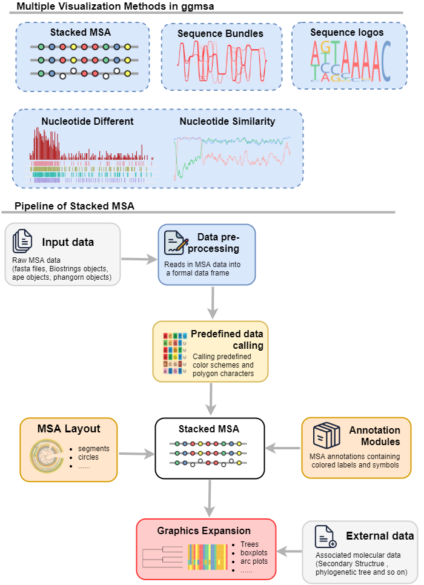

```{r, include = FALSE}
knitr::opts_chunk$set(
  collapse = TRUE,
  comment = "#>"
)
Biocpkg <- function (pkg){
    sprintf("[%s](http://bioconductor.org/packages/%s)", pkg, pkg)
}
CRANpkg <- function(pkg){
    cran <- "https://CRAN.R-project.org/package"
    fmt <- "[%s](%s=%s)"
    sprintf(fmt, pkg, cran, pkg)
}
hooks = knitr::knit_hooks$get()
hook_foldable = function(type) {
   force(type)
   function(x, options) {
     res = hooks[[type]](x, options)
     if (isFALSE(options[[paste0("fold.", type)]])) return(res)
     paste0(
       "<details><summary>", type, "</summary>\n\n",
       res,
       "\n\n</details>"
     )
   }
}
knitr::knit_hooks$set(
  output = hook_foldable("output"),
  plot = hook_foldable("plot")
)

#load package 
library(ggmsa)
library(ggplot2)
```


#  背景介绍

##  摘要 
在多序列比对(Multiple Sequence Alignment,MSA)的可视化中，普遍采用堆叠可视化的形
式，其以行表示每条序列，以列表示相同位置的不同残基字符。我们开发的R包ggmsa在
可视化层面扩展了这种堆叠形式的可视化方法，使得MSA图形可以与各类数据进行整合。
例如：允许将序列二级结构信息、基因座位点信息或表型数据等序列相关的数据集与MSA结
合，以此来探索序列-结构-功能三者之间的关系。并且，我们还开发和整合多种特别的
比对序列可视化方法，包核苷酸差异图、核苷酸相似性图 (鉴定序列重组信号)、
序列集束(Sequence Bundles)和序列标识(Sequence Logos)，
这允许用户从不同角度探索序列的特征。

##  生物学问题描述

###  issues 1 
使用单一的可视化范式很难捕获隐藏在排列中的令人满意的分子特征。

```{r, fig.height = 3, fig.width = 11, message=FALSE, warning=FALSE, dpi=300}
protein_sequences <- system.file("extdata", "sample.fasta", package = "ggmsa")
ggmsa(protein_sequences, 
      start = 221, 
      end = 280, 
      char_width = 0.5,
      seq_name = TRUE,
      border = NA)
```

堆叠图形在展示局部MSA时有很大优势，它以精确到单碱基/氨基酸水平的分辨率展示比对，
并通过染色让用户能快速识别比对的变化趋势。


```{r,  fig.height = 6, fig.width = 10, message=FALSE, warning=FALSE, dpi=300}
ggmsa("../PlantMITERepeatMask.fa", 
      font = NULL, 
      start = 200,
      end = 300,
      seq_name = F,
      border = NA,
      color = "Chemistry_NT") + 
    coord_cartesian()
```


但是当比对序列比较大比较复杂时，会让人产生视觉上的混乱感。因为图形会包含密集的
字符和令人眼花缭乱的配色。

###  issues 2
现有工具缺乏同时探索MSA和相关数据的能力。



我们在探索MSA的序列特征时，往往试图深入序列的系统发育关系和结构功能关系。
因为它们时相互联系，相互影响。但是这在可视化层面就无法完成,
我们没有办法在绘图时把序列和其他数据联系起来。


#  使用ggmsa探索MSA和相关数据

##  ggmsa的技术路线


ggmsa通过两种方案来解决上面的问题。
首先，单一的可视化方法无法得到令人满意的可视化方法，因此ggmsa开发并整合多种
通用的序列可视化方法。这为用户提供了更多可视化手段来从不同角度探索序列数据。

其次，ggmsa 拓展了普通的堆叠图形，使得外部数据可以对齐到MSA的行或者列上，实现
在可视化层面同时探索序列和相关数据。

##  不同的可视化方法

###  堆叠图形


```{r, fig.height = 3, fig.width = 11, message=FALSE, warning=FALSE, dpi=300}
protein_sequences <- system.file("extdata", "sample.fasta", package = "ggmsa")
ggmsa(protein_sequences, 
      start = 221, 
      end = 280, 
      char_width = 0.5,
      seq_name = TRUE,
      border = NA)
```

这是最简单的序列可视化方法
应用的颜色，字体，输入数据类型

```{r}
available_colors()
available_fonts()
available_msa()
```


###  堆叠图形中的注释模块

```{r fig.height = 2.5, fig.width = 11, message=FALSE, warning=FALSE, dpi=300}
protein_sequences <- system.file("extdata", "sample.fasta", package = "ggmsa")
ggmsa(protein_sequences, start = 221, end = 280, char_width = 0.5, seq_name = TRUE) + geom_seqlogo() + geom_msaBar()
```

不同的布局

```{r fig.height = 10, fig.width = 8, message=FALSE, warning=FALSE, dpi=300}
ggmsa(protein_sequences, start = 200, end = 300, char_width = 0.5, seq_name = TRUE) + 
    facet_msa(50) 
```


###  Sequence bundle 


###  Sequence logo


###  Sequence recombination


##  拓展Stacked MSA

###  对齐到行

###  对齐到列

#  总结


