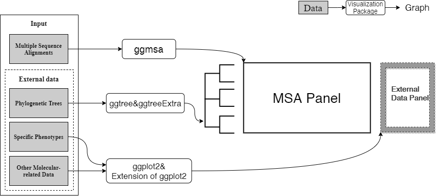

```{r, include = FALSE}
knitr::opts_chunk$set(
  collapse = TRUE,
  comment = "#>"
)
Biocpkg <- function (pkg){
    sprintf("[%s](http://bioconductor.org/packages/%s)", pkg, pkg)
}
CRANpkg <- function(pkg){
    cran <- "https://CRAN.R-project.org/package"
    fmt <- "[%s](%s=%s)"
    sprintf(fmt, pkg, cran, pkg)
}
hooks = knitr::knit_hooks$get()
hook_foldable = function(type) {
   force(type)
   function(x, options) {
     res = hooks[[type]](x, options)
     if (isFALSE(options[[paste0("fold.", type)]])) return(res)
     paste0(
       "<details><summary>", type, "</summary>\n\n",
       res,
       "\n\n</details>"
     )
   }
}
knitr::knit_hooks$set(
  output = hook_foldable("output"),
  plot = hook_foldable("plot")
)

#load package 
library(ggmsa)
library(ggplot2)
library(aplot)
library(phangorn)
library(ggimage)
library(ggtree)
library(readxl)
library(Biostrings)
library(ggnewscale)
library(RColorBrewer)
library(dplyr)
```


#  背景介绍

##  摘要 
多序列比对(Multiple Sequence Alignment,MSA)常被用于探索比对序列中的保守区域和变
异区域。而堆叠图形(Stacked Graphs)是在探索过程中最常用的可视化方式。其以行表示
每条序列，以列表示相同位置的不同残基字符。我们开发的R包`ggmsa`扩展了这种堆叠形
式的可视化方法，并添加了更多可视化方法使用户能更好的观测到MSA的保守区域和变异区
域。另外，`ggmsa`结合`ggtree`和`ggtreeExtra`，可以在大分子层面，观察MSA与表型的
联系。总之，`ggmsa`可以为用户提供的更多的可视化手段，允许用户从不同角度探索序列
特征。


##  ggmsa的应用场景

###  MSA保守和变异位点的可视化

1.MSA中的保守区域:

+ Sequence Bundles
+ Sequence Logos
+ Stacked MSA `+` Annotations


2.序列中的特殊变异区域

+ Sequence Recombination

<!-- 例如：最常用的堆叠模式方法也不能适用于所有情况： -->
<!-- ```{r, fig.height = 3, fig.width = 11, message=FALSE, warning=FALSE, dpi=300, echo=FALSE} -->
<!-- protein_sequences <- system.file("extdata", "sample.fasta", package = "ggmsa") -->
<!-- ggmsa(protein_sequences,  -->
<!--       start = 221,  -->
<!--       end = 280,  -->
<!--       char_width = 0.5, -->
<!--       seq_name = TRUE, -->
<!--       border = NA) -->
<!-- ``` -->

<!-- 堆叠图形在展示局部MSA时有很大优势，它以精确到单核苷酸/氨基酸水平的分辨率展示比对， -->
<!-- 并通过染色让用户能快速识别MSA的变化趋势。 -->


<!-- ```{r,  fig.height = 6, fig.width = 10, message=FALSE, warning=FALSE, dpi=300, echo=FALSE} -->
<!-- ggmsa("data/PlantMITERepeatMask.fa",  -->
<!--       font = NULL,  -->
<!--       start = 200, -->
<!--       end = 300, -->
<!--       seq_name = F, -->
<!--       border = NA, -->
<!--       color = "Chemistry_NT") +  -->
<!--     coord_cartesian() -->
<!-- ``` -->


<!-- 但是当比对序列比较大并且比较复杂时，图形会包含密集的字符和令人眼花缭乱的配色。 -->
<!-- 会让人产生视觉上的混乱感。 -->

###  探索MSA和大分子功能的相关性（分子水平）
 
+ Tree + MSA + Phenotypes

序列，结构，功能是相互联系，相互影响的，基因组的变异可能可以解释表型的变异。
MSA可视化使基因组位点变异信息在视觉上被观测到；基因位置变异信息可以以箭头表示，
其他表型信息也可以用各种可视化方法表示出来。于是，从在可视化层面的将他们结合起来
是完全可行的。这我们可以在可视化层面观察到的序列变异与特殊表型的关联。


##  ggmsa的技术路线


ggmsa中的众多可视化方法主要执行两大功能：

+ 在单核苷酸/氨基酸水平更好的展示MSA的保守区域和变异区域；
+ 在分子水平的观察MSA和相关数据的联系；


#  示例演示

##  使用不同的可视化方法探索MSA的保守性

###  堆叠图形

堆叠图形以行表示每条序列，以列表示相同位置的不同残基字符，并根据不同的残基属性，
为字符渲染不同的颜色。通过着色可以快速识别变化趋势。

```{r, echo=FALSE, out.width = "30%", fig.align='center'}
knitr::include_graphics("images/stacked_MSA.png")
```


```{r, fig.height = 3, fig.width = 11, message=FALSE, warning=FALSE, dpi=300}
protein_sequences <- system.file("extdata", "sample.fasta", package = "ggmsa")
readAAMultipleAlignment(protein_sequences) 
ggmsa(protein_sequences, 
      start = 221, 
      end = 280, 
      char_width = 0.5,
      seq_name = TRUE,
      border = NA)
```

`ggmsa`函数作为基础函数，接收的MSA数据，控制MSA的可视化范围，配色，字体等参数。
参数选择可以用`available`系列函数来查看。

```{r}
available_colors()
available_fonts()
available_msa()
```


###  堆叠图形中的注释模块

注释系统也是ggmsa中的一大亮点。类似于`ggplot2`中图形语法，我们使用
`ggmsa()` + `geom_*()`的模式添加注释。不同的`geom`图层对应不同的注释方法。


```{r fig.height = 2.5, fig.width = 11, message=FALSE, warning=FALSE, dpi=300}
ggmsa(protein_sequences, 
      start = 221, 
      end = 280, 
      char_width = 0.5, 
      seq_name = TRUE) + 
  geom_seqlogo() + 
  geom_msaBar()
```


并且不同注释图层是可以叠加使用的：
```{r  echo=FALSE, results='asis', warning=FALSE, message=FALSE}  

x <- "geom_seqlogo()\tgeometric layer\tautomatically generated sequence logos for a MSA\n
geom_seed()\tannotation module\thighlights seed region on miRNA sequences\n
geom_msaBar()\tannotation module\tshows sequences conservation by a bar chart\n
geom_helix()\tannotation module\tdepicts RNA secondary structure as arc diagrams(need extra data)\n
 "
require(dplyr)
xx <- strsplit(x, "\n\n")[[1]]
y <- strsplit(xx, "\t") %>% do.call("rbind", .)
y <- as.data.frame(y, stringsAsFactors = FALSE)

colnames(y) <- c("Annotation modules", "Type", "Description")

require(kableExtra)
knitr::kable(y, align = "l", booktabs = TRUE, escape = TRUE) %>% 
    kable_styling(latex_options = c("striped", "hold_position", "scale_down"))
  
```


注释模块还可以接收外部数据。RNA的二级结构可以以弧线图的形式添加到MSA。
弧线连接的两个MSA位置表示在结构上是配对的。

使用`ggmsa() + geom_helix()`的模式可以将二级结构数据整合到MSA图形中。
```{r  fig.height = 14, fig.width = 10, warning=FALSE}
RNA7S  <- "data/3JAJ-2D-dotbracket.txt"
RNAP54 <- "data/4UJE-2D-dotbracket.txt"

RF03120_msa<- system.file("extdata", "Rfam", "RF03120.fasta", package = "ggmsa")
RF03120_ss <- system.file("extdata", "Rfam", "RF03120_SS.txt", package = "ggmsa")

known <- readSSfile(RNA7S, type = "Vienna" )
transat <- readSSfile(RNAP54 , type = "Vienna")


RF_arc <- readSSfile(RF03120_ss, type = "Vienna" )

p7A <- ggmsa(RF03120_msa, 
             font = NULL, 
             color = "Chemistry_NT", 
             seq_name = F, 
             show.legend = F, 
             border = NA) +
        geom_helix(helix_data = RF_arc) + 
        theme(axis.text.y = element_blank())

p7B <- ggmsa("data/5SRNA.fa",
             font = NULL,
             color = "Chemistry_NT",
             seq_name = T,
             show.legend = T,
             border = NA) +
  geom_helix(helix_data = list(known = known, 
                               predicted = transat),
             overlap = F)

p7 <- plot_list(gglist = list(p7A, p7B), 
                ncol = 1,
                heights = c(0.15), 
                tag_levels = 'A') 
p7
```


###  堆叠图形中的布局

除了不同的注释图层，我们还为堆叠图形设计不同的布局
```{r facet, fig.height = 6, fig.width = 10, message=FALSE, warning=FALSE}
 # 4 fields
 ggmsa(protein_sequences, start = 0, end = 400, font = NULL, color = "Chemistry_AA") + 
    facet_msa(field = 100)
```


###  Sequence bundle 

Sequence bundles可视化方法在2013年BioVis设计竞赛中被引入，以探索序列之间的残基
关系。MSA的序列被描绘成不间断的、半不透明的线。每条线代表一个序列。
因此整个MSA以序列束的形式被绘制，在y轴上的序列字母表示不同的残基符号并根据不同
的生化特性排序。x轴上代表序列位置。
```{r, echo=FALSE, out.width = "30%", fig.align='center'}

```

ggmsa中用`ggSeqBundle`函数来把MSA可视化为Sequence bundles.最简单的方法是
`ggSeqBundle(msa_data)`。

下列数据包括革兰氏阳性菌和革兰氏阴性菌的腺苷酸激酶盖(Adenylate Kinase Lid, AKL)
结构域。每组各100条序列。
阳性菌在形成半胱氨酸(Cystine)四联体；阴性菌形成氢键网络，
(His4, Ser7, Arg9, Asp24, Thr27, Glu29)

```{r echo=FALSE, fig.height=5.5, fig.width=11, message=FALSE}
negative <-  system.file("extdata", "Gram-negative_AKL.fasta", 
                         package = "ggmsa")
positive <-  system.file("extdata", "Gram-positive_AKL.fasta", 
                         package = "ggmsa")

pos <- data.frame(x= c(4, 7, 9, 24, 27, 29,
                       4, 7, 24, 27), 
                  y = c(c(21, 11, 20, 17, 12, 18) +.3,
                        c(13, 13, 13, 13) +.5
                        ), 
                  label = c("H", "S", "R", "D", "T", "E",
                            "C", "C", "C", "C"),
                  color = c(rep("#ff4700",6), 
                            rep("#0443d0",4)))

ggSeqBundle(list(negative, positive), 
            alpha = 0.1, 
            bundle_color = c("#FC8D62","#8DA0CB"))+ #RColorBrewer: Set2:2-3
    geom_text(data = pos, 
              mapping = aes(x, y, 
                            label = label, 
                            color = I(color)),
              inherit.aes = FALSE, 
              size = 4)

```
(Date from BioVis2013 and repeated example from [Science Practice](https://www.science-practice.com/projects/sequence-bundles/gallery/))

###  Sequence logo

Sequence logo可视化方法计算了MSA中每列字符的的频率，并把每列的字符根据频率缩放，
进行堆叠。

```{r, echo=FALSE, out.width = "30%", fig.align='center'}

```


ggmsa中的Sequence logo可以作为注释图层添`geom_seqlogo`添加到堆叠图形中。
```{r fig.height = 3, fig.width = 11, warning = FALSE, message = FALSE}
 ggmsa(protein_sequences, 221, 280, seq_name = TRUE, char_width = 0.5, font = NULL) +
    geom_seqlogo(color = "Chemistry_AA") 
```

也可以用`seqlogo`函数进行单独的渲染。使用方法与`ggmsa`相似，可是通过参数控制位置，
配色和字体。`patchwork`包可以把sequqnce logos 和 sequence bundles组合起来。
```{r fig.height = 2.5, fig.width = 8, warning = FALSE, message = FALSE}
 seqlogo(protein_sequences, 221, 280)
```

##  序列的中特殊的变异


除了通过可视化方法探索MSA的保守性,`ggmsa`还设计专门的可视化方法来观测序列中特殊
的变异位点。为鉴定序列中的潜在的重组信号提供线索。
```{r, echo=FALSE, out.width = "30%",out.height='50%', fig.align='center'}
knitr::include_graphics("images/recombination.png")
```

选择一个潜在序列(query)，`seqdiff`可以计算query和其他序列在每个位置上是否存在
核苷酸差异。并把固定区域的差异数目以柱状图的形式展示(`plot(seqdiff)`)。

同理，用`simplot`函数计算序列间的相似性。例如：`CF_YL21` vs `Mont,Oz and Wilg5`
```{r  fig.height = 11, fig.width = 10, warning=FALSE, message=FALSE}
fas <- list.files(system.file("extdata", "GVariation", package="ggmsa"),
                  pattern="fas", full.names=TRUE)
xx <- lapply(fas, seqdiff)
plts <- lapply(xx, plot, width = 100)
fas[4] <- system.file("extdata/GVariation/sample_alignment.fa", 
                    package="ggmsa")# + theme(legend.position = "bottom")
plts[[4]] <- simplot(fas[4], 'CF_YL21')
plot_list(gglist=plts, ncol=1, tag_levels = list(c("A",' ',"B", ' ',"C", ' ', "D")))
```


##  探索MSA和相关数据的联系

通过`ggtree`或者`ggtreeExtra`分面功能，形成Tree-MSA-External 的图形结构，
从可视化的角度观察MSA和特殊的表型之间的联系。


通过`ggtree(tree) + geom_facet(geom_msa) + geom_facet(ohters)`或者
`ggtree(tree) + geom_fruit(geom_msa) + geom_fruit(others)`的代码模式来整合外部
数据。
```{r  fig.height = 4, fig.width = 15, warning=FALSE}
#load MSA and genes locus
tp53_sequences <-  system.file("extdata", "tp53.fa", package = "ggmsa")
tp53_genes <- system.file("extdata", "TP53_genes.xlsx", package = "ggmsa")

#generating phylogenetic tree according to MSA
dat <- read.aa(tp53_sequences, format = "fasta") %>% phyDat(type = "AA", levels = NULL)
tree <- dist.ml(dat, model = "JTT") %>% bionj()
dd <- ggimage::phylopic_uid(tree$tip.label)

#visualizing phylogenetic tree by ggtree
p_tp53 <- ggtree(tree, branch.length = 'none') %<+% dd +
  geom_tiplab(aes(image=uid), geom = "phylopic", offset =1.9) +
  geom_tiplab(aes(label=label)) +
  geom_treescale(x = 0,y = -1)

#deal with MSA data
data_53 <- readAAMultipleAlignment(tp53_sequences) %>% tidy_msa()

#gene maps
TP53_arrow <- read_xlsx(tp53_genes)
TP53_arrow$direction <- 1
TP53_arrow[TP53_arrow$strand == "reverse","direction"] <- -1

#color
mapping = aes(xmin = start, xmax = end, fill = gene, forward = direction)
my_pal <- colorRampPalette(rev(brewer.pal(n = 10, name = "Set3")))

#tree + gene maps + msa
p6a <- p_tp53  + xlim_tree(4) +
  geom_facet(geom = geom_msa, data = data_53,
             panel = 'Multiple Sequence Alignment of the TP53 Protein', font = NULL,
             border = NA) +
  new_scale_fill() +
  scale_fill_manual(values = my_pal(10)) +
  geom_facet(geom = geom_motif,
             mapping = mapping, data = TP53_arrow,
             panel = 'Genome_Locus',  on = 'TP53',
             arrowhead_height = unit(3, "mm"),
             arrowhead_width = unit(1, "mm")) +
  theme(strip.background=element_blank(),
        strip.text = element_text(size = 13))
p6A <- facet_widths(p6a, c(Tree = 0.35, Genome_Locus = 0.3))
p6A
```


#  总结

可视化探索MSA是分子生物学的重要内容，但在堆叠的MSA图形中表现并不佳。我们开发的R
包ggmsa，用于可视化地探索MSA和相关数据。它包含一系列通用MSA可视化方法，并通过将
多个相关数据集成到堆叠MSA图形中，扩展了堆叠MSA可视化方法的使用范围。堆叠的MSA图形
集成多个外部数据，在视觉层面探索序列特征的相关性。因此，将不同类型的外部数据与
MSA相结合，可以观察到不同的相关性。对同一个MSA数据采用多种可视化方法，可以从不同
角度探索序列特征。ggmsa中的sequence logos和sequece bundles能快速识别出MSA中的
sequence pattern和残基相关性。最后的碱基差异性和相似性图谱，用于鉴定序列重组事件。
因此，ggmsa代表了对以前拓展性受限的堆叠可视化方法的和可视化方法应用单一的工具的
实质性改进。


## 8. Session information

以下是本次workshop中系统，R版本以及使用的包的信息：

```{r, echo=FALSE}
sessionInfo()
```

